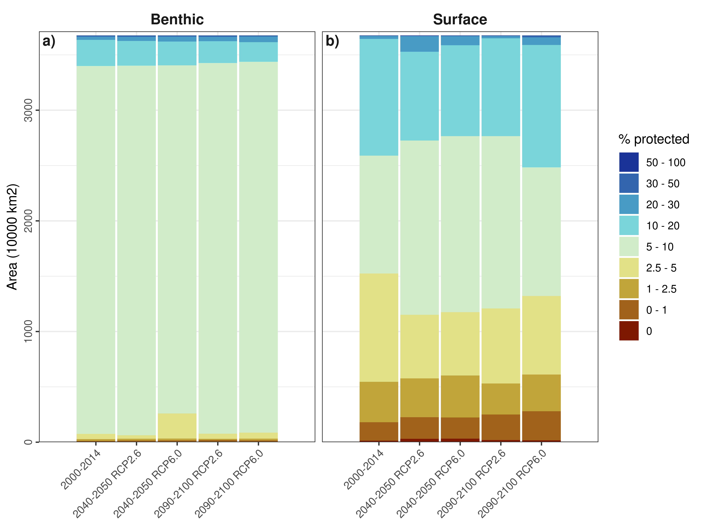

**Running head:** Biophysical representation of MPAs under climate change

```{r opts, include = FALSE}
knitr::opts_chunk$set(collapse = T, tidy=T, comment = NA, warning=F, message=F, eval=T, echo=F)
```

```{r setup, include=FALSE}
knitr::opts_chunk$set(comment = NA, warning=F, message=F, echo=F, fig.path="figures/", dpi = 1000)
```

**Main message:** Representation of MPAs varies strongly across biophysical conditions and will suffer under future climate change.

## Abstract:

<!--Context and aim, Methods, Core results, Interpretation in context, Application -->

1. Marine Protected Areas (MPAs) provide the best way of conserving marine biodiversity and ecosystem services. Yet, MPAs suffer various anthropogenic threats, which in the near-future will exacerbate with climate change. 

2. Here we analyse the biophysical representation of the current MPA network and specifically assess the representation of temperature, salinity and their interaction for now and the future, using current global environmental data layers and future climate projections from global ocean climate models.

3. We found that there is a strong bias in protection across conditions for the majority of bioclimatic variables considered. The representation of protection for temperature, salinity and their interacttion is further going to change considerably under future climate change.

**Keywords:** temperature, salinity, benthic, surface, conservation, Bio-ORACLE

<!--

## INTRODUCTION

...

## Methods

### Protected areas

Global marine protected area (MPA) data were compiled from the World Database on Protected Areas (https://protectedplanet.net IUCN & UN Environment Programme 2020). We obtained polygon data for 10,724 coastal and 5,578 marine protected areas (PAs), but excluded PAs with point information only, as the analysis required spatially explicit information on the size and extent of each PA. We considered designated and non-designated MPAs and differentiated among four protection categories (IUCN categories Ia, Ib and II = I-II, IUCN categories III and IV = III-IV, IUCN categories V and VI = V-VI, IUCN categories not reported, not applicable and not assigned = Non-designated). The IUCN categories group MPAs according to their management objective. IUCN categories Ia, Ib and II include Strict Nature Reserves, Wilderness Areas and National Parks, IUCN categories III and IV include Natural Monuments or Features and Habitat/Species Management Areas, IUCN categories V-VI include Protected Land- and Seascapes and Protected Areas with Sustainable Use of Natural Resources. We classified the IUCN protection categories into four classes (I-II, III-IV, V-VI and Non-designated), as IUCN categories I-IV have a biodiversity focus, while IUCN categories Ia, Ib and II additionally focus on the protection of intact ecosystems (Dudley 2008).

Some PAs in the dataset were overlapping, i.e. some protected landscapes contain national parks within them, therefore we dissolved overlapping polygons and only kept the polygon with the stricter protection category. For each of the three protection categories, we than calculated the area of each polygon that lay within or intersected with each grid cell of a raster with 1 km resolution (Fig. 1 a). This resulted in four gridded layers of % cover of protection for each of the four protection categories (I-II, III-IV, V-VI, Non-designated).

### Marine data 

Mean annual sea surface temperature (SST, biogeo13), mean annual sea surface salinity (SSS, biogeo08) and bathymetry were derived from MARSPEC (http://www.marspec.org/, Sbrocco & Barber 2013). MARSPEC is the best high-resolution global marine data set currently available and is a 10-fold improvement in spatial resolution of the next-best dataset (Bio-ORACLE, see Tyberghein et al. 2012). It combines different satellite and in situ observations of sea surface temperature, salinity and bathymetry of the global ocean and combines them to a harmonized dataset at a spatial resolution of 1km2. Bathymetry data was derived from SRTM30_PLUS v6.0, while the climatic layers were derived from NOAA’s World Ocean Atlas (SSS) and NASA’s Ocean Color Web (SST). The climatic variables range over varying time periods (SSS = 1955 – 2006, SST = 2002 – 2010), but provide both information about inter-annual means and their variance (Sbrocco & Barber 2013). Similar to the terrestrial data, we also provide results for annual range in SSS and SST as well as annual variance in SSS and SST, which were also derived from MARSPEC (see Supporting Information, Fig. S2).

### Protection coverage

We divided the amplitude of each climatic and physical variable into bins (1°, 100 mm, 100 m and 1 PSU for temperature, precipitation, elevation/bathymetry and salinity, respectively; Fig. 1 b). For each variable, we then combined these bins with the different layers of % area protected by calculating the area per bin that is protected and dividing it by the total area covered by each bin, only considering PAs for which environmental data exists (Fig. 1 c, d). We performed a sensitivity analysis to see how the chosen bin size influences our results (see Supporting Information, Fig. S3 & S4). To look at the correlation in protection across the variables, we performed the same procedure for each pairwise combination of all terrestrial and all marine variables respectively and calculated the area that was covered by each grid cell of the pairwise comparison (see Supporting Information, Fig. S5).

To derive a map of % environmental protection for each variable, which indicates how well the underlying environmental condition of a given location is protected globally, we then combined the binned data with the % area protected of each bin (Fig. 1e, see Supporting Information, Fig. S6 & S7). Following the CBD's Aichi Target 11 goal to protect 17% of terrestrial land and 10% of marine area by 2020, these maps were then combined into a binary map, by classifying the proportion of the environmental condition protected as below or above the respective target. The binary maps of the different variables could then be overlayed onto a single map, highlighting areas where one or multiple variables lie below or above the target.

Last but not least, we took the overlay maps and calculated the area of each terrestrial zoogeographic realm (Holt et al. 2013) and marine biogeographic realm (Costello et al. 2017) that was covered by each of the different categories, respectively.

The entire analysis was performed in R version 3.6 (R Core Team, 2020). The full code of the performed analysis and the shown Figures is publicly available from: https://github.com/RS-eco/futMPA/.

## Results

...

## Discussion

...

## References

...

-->

## Figures


**Figure 1.** Percentage of area protected separately for different IUCN categories for different surface bioclimatic conditions (a) Chlorophyll, b) Diffuse attenuation, c) Dissolved oxygen, d) Ice cover, e) Current velocity, f) Ice thickness, g) Nitrate, h) Phosphate, i) Phytoplankton, j) Silicate, k) Temperature, l) Salinity). In order to calculate the % of area protected, the different bioclimatic conditions were divided into equally-spaced bins (1° for temperature, 1 psu for salinity, ...). Three measurements are shown in the histograms: the total area covered by each class (light gray bars), the area under protection in each class (colour-coded by the different IUCN protection classes), and the fraction under protection of each class (red dots and lines, y-axes on the right hand side).
<!-- Add old Figure to Appendix? --> 
<!-- Add maps to Appendix? -->
<!-- Add colour legend for grey colour!!!-->


**Figure 2.** Expected future change (%) in protected area for different a), b) temperature and c), d) salinity conditions for benthic (a, c) and surface (b, d) environments. Percentage change is shown for two representative concentration pathways RCP2.6 and RCP6.0(solid and dashed line respectively) under the two time periods 2040 - 2050 & 2090 - 2100 (red and blue colour respectively). Please note that the x- and y-axes of the upper and lower panel are different to each other.
<!-- Add figure on variation among IUCN categories -->


**Figure 3.** Currently protected climate space (two-dimensional frequency distribution of temperature and salinity, discretized into 1°C temperature and 1 psu salinity bins) for a) benthic and c) surface conditions within all protection categories and the respective (b, d) total area covered by different protection classes.
<!-- Add figure on variation in interaction among IUCN categories. -->
<!-- Add depth as additional variable? -->

 

**Figure 4.** Percentage change in the protected climate space (future - current % protected climate space) for benthic and surface conditions under RCP2.6 & RCP6.0 for the time period 2090 - 2100. 
<!-- 
Adjust colour scheme to a meaningful variation =>
Does not make sense to show % change if grid cells cover different amount of areas!!!
-->

<!-- Show RCP2.6 and RCP6.0 for early time period in the appendix -->
<!-- Add pie/bar charts on total area. (already done, see fut_area_bins.png) -->

<!--


**Figure 5.** Maps of the % change in protection (2040 - 2050 RCP2.6) according to each bioclimatic condition ((a,b) temperature, (c,d) salinity and (e,f) pairwise combination of temperature and salinity for surface (a,b,c) and benthic (d,e,f) conditions. The % protected is based on the equally-spaced bins shown in Figure 2 and 3. Maps are in Mollweide projection (ESRI:54009).
-->

## Supporting Information


**Supplement Figure 1.** Percentage of area protected separately for different IUCN categories for different benthic bioclimatic conditions (a) Chlorophyll, b) Diffuse attenuation, c) Dissolved oxygen, d) Current velocity, e) Nitrate, f) Phosphate, g) Phytoplankton, h) Silicate, i) Temperature, j) Salinity). In order to calculate the % of area protected, the different bioclimatic conditions were divided into equally-spaced bins (1° for temperature, 1 psu for salinity, ...). Three measurements are shown in the histograms: the total area covered by each class (light gray bars), the area under protection in each class (colour-coded by the different IUCN protection classes), and the fraction under protection of each class (red dots and lines, y-axes on the right hand side). <!-- Add colour legend for grey colour!!!-->

 
**Supplement Figure 2.** Percentage of area protected separately for different IUCN categories for surface Temperature and Salinity for current (2000 - 2014) and future conditions (2040-2050 RCP2.6, 2040-2050 RCP6.0, 2090-2100 RCP2.6 and 2090-2100 RCP6.0). In order to calculate the % of area protected, the different bioclimatic conditions were divided into equally-spaced bins (1° for temperature, 1 psu for salinity). Three measurements are shown in the histograms: the total area covered by each class (light gray bars), the area under protection in each class (colour-coded by the different IUCN protection classes), and the fraction under protection of each class (red dots and lines, y-axes on the right hand side).

 
**Supplement Figure 3.** Percentage of area protected separately for different IUCN categories for surface Current velocity and Ice thickness for current (2000 - 2014) and future conditions (2040-2050 RCP2.6, 2040-2050 RCP6.0, 2090-2100 RCP2.6 and 2090-2100 RCP6.0). In order to calculate the % of area protected, the different bioclimatic conditions were divided into equally-spaced bins (... for current velocity, ... for ice thickness). Three measurements are shown in the histograms: the total area covered by each class (light gray bars), the area under protection in each class (colour-coded by the different IUCN protection classes), and the fraction under protection of each class (red dots and lines, y-axes on the right hand side).

 
**Supplement Figure 4.** Percentage area protected for different temperature, salinity, current velocity and sea ice thickness conditions for benthic and surface environments. Percentage area protected is shown for current conditions (2000 - 2014) and for future conditions, the time periods 2040 - 2050 & 2090 - 2100 (red and blue colour respectively) and two representative concentration pathways RCP2.6 and RCP6.0 (solid and dashed line respectively). Please note that the x- and y-axes of the upper and lower panel are different to each other.

 
**Supplement Figure 5.** Expected future change (%) in protected area for different a), b) current velocity  and c), d) sea ice thickness conditions. Current velocity is shown for benthic (a) and surface (b) conditions. Percentage change is shown for two representative concentration pathways RCP2.6 and RCP6.0 (solid and dashed line respectively) under the two time periods 2040 - 2050 & 2090 - 2100 (red and blue colour respectively). Please note that the x- and y-axes of the upper and lower panel are different to each other.

<!--
 
**Supplement Figure 5.**

 
**Supplement Figure 6.**

 
**Supplement Figure 9.**
-->

 
**Supplement Figure 6.** Current (2000 - 2014) and future (2040-2050 RCP2.6, 2040-2050 RCP6.0, 2090-2100 RCP2.6 and 2090-2100 RCP6.0) protected climate space (two-dimensional frequency distribution of temperature and salinity, discretized into 1°C temperature and 1 psu salinity bins) for a)-e) benthic and f)-j) surface conditions within all protection categories.

 
**Supplement Figure 7.** Total area covered by different protection classes represented in the protected climate space (see Supplement Figure 7 and Figure 3) for current (2000 - 2014) and future (2040-2050 RCP2.6, 2040-2050 RCP6.0, 2090-2100 RCP2.6 and 2090-2100 RCP6.0) as well as benthic and surface conditions.

 

**Supplement Figure 8.** Percentage change in the protected climate space (future - current % protected climate space) for benthic and surface conditions under RCP2.6 & RCP6.0 for the time period 2040 - 2050. 

<!-- 
Add Supplement Table (see Baldi et al. 2017) for different regions
-->